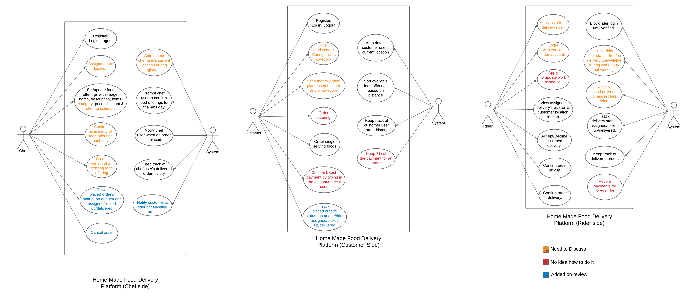
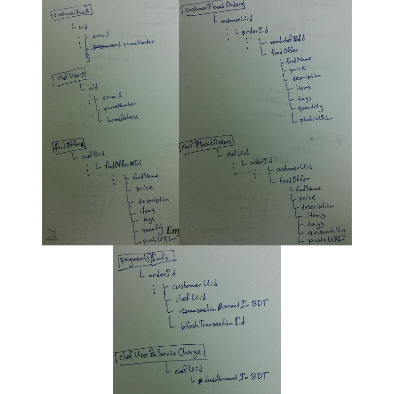

# Documentation Short-hands

Noted down documentation suplements such as- use case diagram, feature list, APIs  

## Project Description

Google docs link-  
https://docs.google.com/document/d/13k6JFobf1ehFxS1JiSu4tFIxx0fdNKmcdAk6A1n1Gww/edit  

## Use case diagram

Use case diagram created using lucidchart-  
https://lucid.app/invitations/accept/6b9bb266-a47c-4394-a7a1-6f76b722b633  

  

## Features

### **Chef/Food Vendor side features**
  
1. Register as a chef user & login-logout  

2. Assign/update home location  

3. Auto-detect chef user's location during registration. **[S]**

4. Set/update food offerings. Each new food offering has,
    - *Image*- Image of the food.  

    - *Name*- name of the food.

    - *Description*- Short one-two lines of description.  

    - *Items*- Ingredients used to make the food.  
  
    - *Category*- Category of food (pre-defined or user-defined?)  

    - *Quantity*- User-specified quantity. (as a string?)

    - *Price*- Price of single serving of the food.  

    - *Discount*- Percentage discount on the price set.  

    - *Offering Schedule*- Week days on which the food is likely to be offered.  

5. Prompt chef user to confirm food offering scheduled for th next day. **[S]**  

6. Confirm scheduled food offering each day.  

7. Create variant of an existing offering.  

8. Notify chef user when an order is placed. **[S]**  

9. Cancel placed order.  

10. Notify rider(if assigned) and customer of cancelled order. **[S]**  

11. Keep track of chef user's delivered orders. **[S]**  

12. Track placed order's status, **[S]**
    - *In Queue*- Rider not assigned yet.  
    - *Rider Assigned*- Rider assigned not picked up yet.  
    - *Picked Up*- delivery picked up from vendor and on the way.
    - *Delivered*- Customer received the food.

### **Customer side features**

1. Register as a chef user & login-logout.  

2. Auto-detect customer user's current location. **[S]**  

3. Sort available food offerings based on distance. **[S]**  

4. Filter vendor food offerings list shown in home screen by category.  

5. Set a monthly meal plan based on item and/or category and/or item.  

6. Order catering. (order for an event? if so, then how to implement?)  

7. Order single serving food (based on vendor-specified quantity)  

8. Confirm bKash payment by typing in alphanumeric 10 letter code. (whats the process exactly?)  

9. Keep track of customer user order history. **[S]**  

10. Keep 7% of the payment for an order. (how?) **[S]**  

11. Track placed order's status, **[S]**  
    - *In Queue*- Rider not assigned yet.  
    - *Rider Assigned*- Rider assigned not picked up yet.  
    - *Picked Up*- delivery picked up from vendor and on the way.
    - *Delivered*- Customer received the food.

### **Rider side features**
  
1. Apply to become a food delivery rider by providing,  
    - *Full Name*  
    - *Work Schedule* - Days and hours rider wants to work for.
    - *Phone Number*  
    - *Age* - Must be above 18.  
    - *Vehicle Type* - Bicycle, Motorbike, Car
    - *Vehicle Purchase Documents* - Attach photo of documents that prove of vehicles ownership.
    - *Driver's License* - Attach photo.
    - *NID Card Photo* Attach photo.

2. Block rider account until verified.**[S]**  

3. Login with verified rider account using,
   - *Phone number* - used during applying.
   - *Assigned Password* - password is assigned by system after rider is verified.  

4. Apply to update work schedule.  

5. Track rider user's status, **[S]**
   - Free - During work hour but rider isn't assigned any delivery.  
   - On Delivery - Currently working on a delivery.  
   - Unavailable - Rider is unavailable during work hour(not online in app).  
   - Not working - It's not rider's work schedule.  

6. Assign placed order's delivery to nearby rider. **[S]**  

7. View assigned delivery's pickup & customer location.  

8. Accept or Decline assigned delivery.  

9. Track delivery's status, **[S]**
    - *Rider Assigned*- Rider assigned not picked up yet.  
    - *Picked Up*- delivery picked up from vendor and on the way.
    - *Delivered*- Customer received the food.  

10. Confirm order pickup.  

11. Confirm order delivery.  

12. Keep track of delivered orders. **[S]**  

13. Record payments for every order. **[S]**  

## Database Structure  

Nosql json database structure (the design only contains structure for customer and chef app features for noe)

