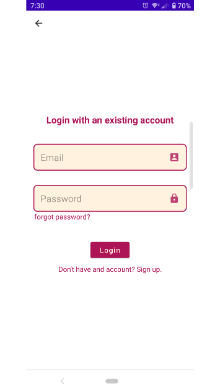
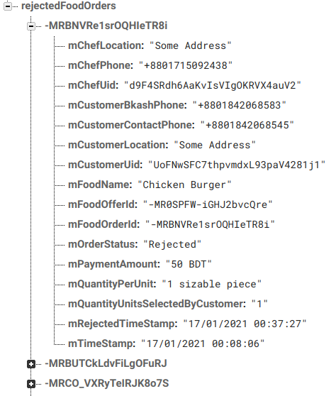

&nbsp;

&nbsp;

<strong></strong>

<strong>North South University</strong>

Department of Electrical &amp; Computer Engineering

<strong>Project Report</strong>

<strong>Fall 2020</strong>

<strong>Project Name</strong>: Home Meal App

<strong>Course</strong>: CSE 486 <strong>Sec</strong><strong>:</strong> 1

<strong>Faculty</strong>: Shaikh Shawon Arefin Shimon (Sas3)

<strong>Name</strong><strong>:</strong> Ferdous Zeaul Islam

<strong>ID</strong><strong>:&nbsp; </strong>1731136042

<strong>Email</strong><strong>:</strong> <a href="mailto:mohammed.rahman03@northsouth.edu">ferdous.islam@northsouth.edu</a>

<strong>Git Repository</strong><strong>: </strong><a href="https://github.com/NSU-FA20-CSE486-1/1731136_FA2020_CSE486.1">https://github.com/NSU-FA20-CSE486-1/1731136_FA2020_CSE486.1/</a>

<strong>Date Prepared</strong><strong>: </strong>20/01/2020

<strong>&nbsp;</strong>

<strong>&nbsp;</strong>

## INTRODUCTION

Your one stop destination to order and sell home-cooked meals. Register as a customer and order healthy meals prepared with a touch of domestic bliss. Register as a vendor and turn your culinary hobby into a livelihood from home.
  

What do you get as a customer?  

- Order house-cooked low-cost, tasty & healthy foods, find nearby food offers and order for the food to arrive to you.  
- Connect with the vendors directly, communicate with the vendors at a more personal level.  
- Easy & transparent payment system, bKash payments directly to the vendor without any interference from the app.
  
What do you get as a vendor/caterer?  

- A dedicated platform to sell house-cooked meals, put out your offers and wait for customers to order.  
- Connect with the customers directly, communicate with the customers at a more personal level.  
- Easy & transparent payment system, receive payments directly from customers in bKash and pay a small a service charge weekly.

## FEATURES

### Customer side features

<ul>
<li>Sign up, Login, Logout.</li>  

 

 

<li>View food offers, filter by region (Mirpur, Uttora, Badda etc).</li>  

 

 

<li>Place an order.</li>  

 

   

<li>Track placed orders.</li>  

 

  

<li>Confirm payment for an order.</li>  

 

  

 

</ul>

### Vendor/Chef side features  

<ul>
<li>Sign up, Login, Logout.</li>  

 

 

<li>Add/Remove food offers, create variants.</li>  

 

  

<li>Get notified when customers place orders.</li>  

 

  

<li>View, accept/reject orders placed by customers.</li>  

 

  

<li>Confirm service charge payments.</li>  

 

  

</ul>

 

## DATA MANAGEMENT  

Firebase was used for storing all relevant data for this app because the Spark plan (free tier) allows significantly enough free resources for a project prototype deployment. The features of Firebase that were used in the project are,  

#### 1. Firebase Authentication (Email, Password)  

   Customer and vendors, both type of users are required to sign up with an email and password. The provided email and passwords are used to authenticate an user for logging in.  

#### 2. Firebase Realtime Database  

   Customer and vendors, both type of users are required to sign up with an email and password. The provided email and passwords are used to authenticate an user for logging in.  

     
     
     
     
     
     

#### 3. Firebase Storage  

   Firebase storage was used for storing image files of a food offer provided by the vendors.

   

## DESIGN PATTERN  

No particular architectural pattern was followed to implement the project. To avoid coupling, implementation of different components were separated into separate classes following the SOLID principal, particularly S (single responsibility) and O (open for extension closed for modification). The components were-  

1. [User Authentication](https://github.com/NSU-FA20-CSE486-1/1731136_FA2020_CSE486.1/tree/main/Android%20Project/Project/HomeMealApp/app/src/main/java/com/ferdouszislam/nsu/cse486/sec01/homemealapp/auth)
2. [DAOs for accessing database](https://github.com/NSU-FA20-CSE486-1/1731136_FA2020_CSE486.1/tree/main/Android%20Project/Project/HomeMealApp/app/src/main/java/com/ferdouszislam/nsu/cse486/sec01/homemealapp/daos)
3. [Photo upload, download](https://github.com/NSU-FA20-CSE486-1/1731136_FA2020_CSE486.1/tree/main/Android%20Project/Project/HomeMealApp/app/src/main/java/com/ferdouszislam/nsu/cse486/sec01/homemealapp/chef/imageUpload)
4. Recyclerview Adapters- [(chef)](https://github.com/NSU-FA20-CSE486-1/1731136_FA2020_CSE486.1/tree/main/Android%20Project/Project/HomeMealApp/app/src/main/java/com/ferdouszislam/nsu/cse486/sec01/homemealapp/chef/recyclerViewAdapters), [(customer)](https://github.com/NSU-FA20-CSE486-1/1731136_FA2020_CSE486.1/tree/main/Android%20Project/Project/HomeMealApp/app/src/main/java/com/ferdouszislam/nsu/cse486/sec01/homemealapp/customer/recyclerViewAdapters)
5. [Shared preference handling classes](https://github.com/NSU-FA20-CSE486-1/1731136_FA2020_CSE486.1/tree/main/Android%20Project/Project/HomeMealApp/app/src/main/java/com/ferdouszislam/nsu/cse486/sec01/homemealapp/sharedPreferences)
6. [Utility classes consisting of only static methods and variables](https://github.com/NSU-FA20-CSE486-1/1731136_FA2020_CSE486.1/tree/main/Android%20Project/Project/HomeMealApp/app/src/main/java/com/ferdouszislam/nsu/cse486/sec01/homemealapp/utils)  

These components were used inside android specific Activity (and Service) classes to implement the business logic and create an interactive connection between the data models and the view/UI.  

   

## ROADBLOCKS  

1. Images taken for food offers from the vendor end can be of large sizes, in that case it will take more time to upload as well as download when being viewed. A maximum size limit could have been imposed by resizing images in the back end.

2. Service class created for giving notifications([NotificationService](https://github.com/NSU-FA20-CSE486-1/1731136_FA2020_CSE486.1/blob/main/Android%20Project/Project/HomeMealApp/app/src/main/java/com/ferdouszislam/nsu/cse486/sec01/homemealapp/services/NotificationService.java)) in the background does not run continuously when launched from a fragment class([SettingsFragment](https://github.com/NSU-FA20-CSE486-1/1731136_FA2020_CSE486.1/blob/main/Android%20Project/Project/HomeMealApp/app/src/main/java/com/ferdouszislam/nsu/cse486/sec01/homemealapp/appSettings/SettingsFragment.java)) class and gets destroyed immediately when app closes. However, this does not happen if the same Service is launched from Activity([CustomerHomeActivity](https://github.com/NSU-FA20-CSE486-1/1731136_FA2020_CSE486.1/blob/main/Android%20Project/Project/HomeMealApp/app/src/main/java/com/ferdouszislam/nsu/cse486/sec01/homemealapp/customer/activities/CustomerHomeActivity.java), [ChefHomeActivity](https://github.com/NSU-FA20-CSE486-1/1731136_FA2020_CSE486.1/blob/main/Android%20Project/Project/HomeMealApp/app/src/main/java/com/ferdouszislam/nsu/cse486/sec01/homemealapp/chef/activities/ChefHomeActivity.java)) classes. But the Android OS reserves the power to destroy a service anytime and restart it later. 

3. The features below were not implemented,  
(i) Customers create a monthly meal plan.  
(ii) Sort food offers based on distance from the customers current location.  
(iii) Filter food offers based on categories.  
(iv) No local database.  
(v) No Rider user functionalities.  
