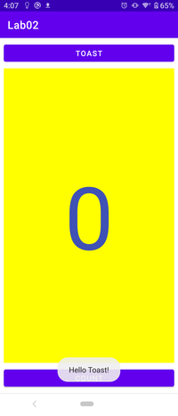
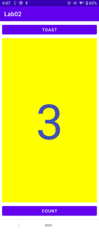
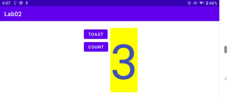
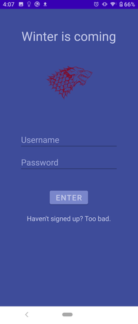
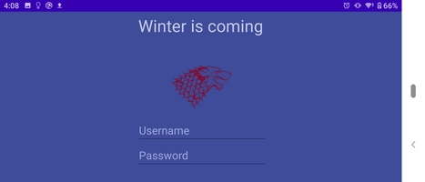
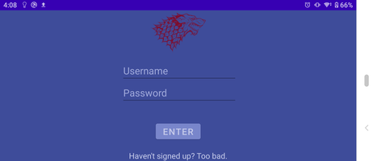
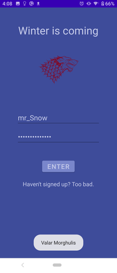
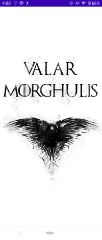
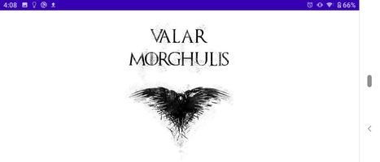

# Week 02 Classwork & Assignment

Contains two android projects for classwork and assignment.

## Android Project 'Lab02': in class lab work

- Count button, count text & Show toast button.
  
    
    &nbsp;&nbsp;&nbsp;&nbsp;&nbsp;&nbsp;&nbsp;&nbsp;
    

- Create landscape layout variant

- **Retain counter value on screen rotation**  
  
      

## Android Project 'Signup-Login-Application': assignment

- Login screen custom ui
  
  

- **Landscape variant for login layout with scrollview**
  
    

  

- Log in successful toast & **change layout view**
  
  
  &nbsp;&nbsp;&nbsp;&nbsp;&nbsp;&nbsp;&nbsp;&nbsp;
  

- **Restore changed logged in view on screen rotation**  
 
