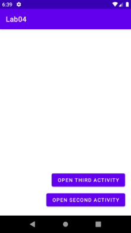
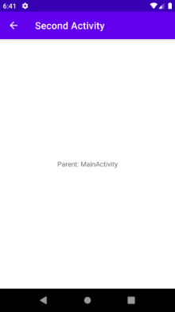
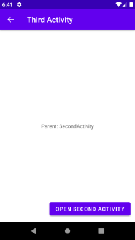
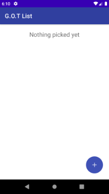
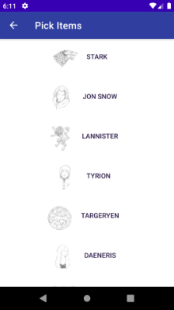
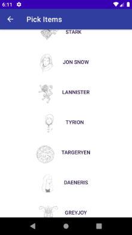
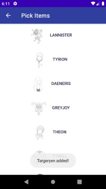
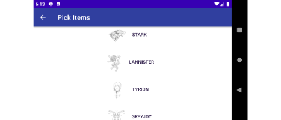
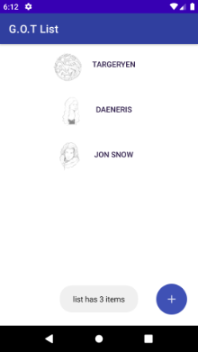
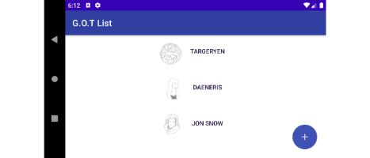

# Week 04 Classwork & Assignment

Contains two android projects for classwork and assignment.

## Android Project 'Lab04': in class lab work

- Activity navigation using parentOf attribute in manifest, observing actionbar and hardware back button effect
  
- MainActivity is the parent of SecondActivity, SecondActivity is the parent of ThirdActivity
  
- App flow:  

    MainActivity -> SecondActivity -> ThirdActivity -> SecondActivity

    after reaching SecondActivity from ThirdActivity physical back button takes back to ThirdActivity but actionbar's back takes to parent of SecondActivity, the MainActivity.

    &nbsp;&nbsp;&nbsp;&nbsp;&nbsp;&nbsp;&nbsp;&nbsp;&nbsp;&nbsp;

## Android Project 'List App': assignment

- Pick from list in SelectItemActivity to populate list in MainActivity  

- Pass selected list items from SelectItemActivity to MainActivity  

- Pass data from MainActivity to SelectItemActivity on which items have already been chosen

- Save state of lists on both the activity by storing to reloading from savedInstanceState

&nbsp;&nbsp;&nbsp;&nbsp;&nbsp;&nbsp;&nbsp;&nbsp;&nbsp;&nbsp;

 

  

