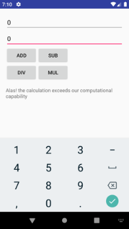
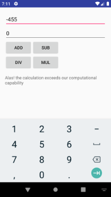

# Week 06 Assignment

Contains android project for the assignment.

## Android Project 'SimplCalc App': assignment

- Debug: add, substract, multiply, divide operations.
  
- Handle divide by zero, overflow/underflow, zero by zero, negative number input  

&nbsp;&nbsp;&nbsp;&nbsp;&nbsp;&nbsp;&nbsp;&nbsp;&nbsp;&nbsp;
