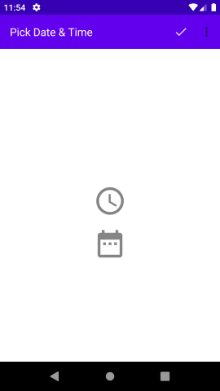
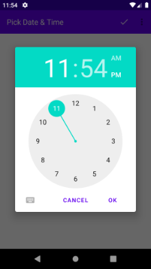
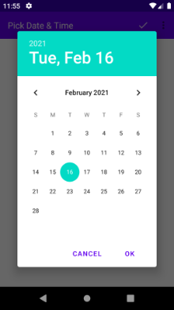
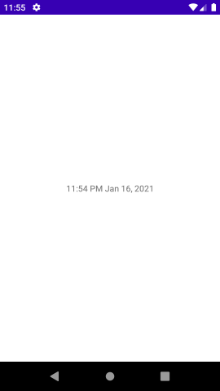
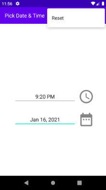
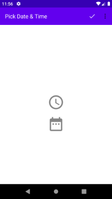

# DateTime Picker App Assignment  

Show date & time picked fragment by clicking clock and calendar icon,  

&nbsp;&nbsp;&nbsp;&nbsp;&nbsp;&nbsp;&nbsp;&nbsp;&nbsp;&nbsp;  

**Validate** & format selected date & time and show on next activity on appbar's 'Check icon' click,  

&nbsp;&nbsp;&nbsp;&nbsp;&nbsp;  

Reset inputs by selecting appbar's drop-down 'Reset' option,

&nbsp;&nbsp;&nbsp;&nbsp;&nbsp;