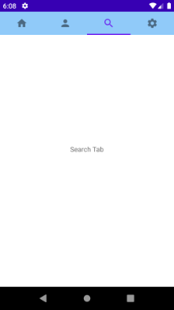

# TabsApp Assignment  

**N.B- Tried to implement with AndroidX library, tab on click does not work but tabs can be switched by swiping**

- Show 4 tabs selectable by clicking and swiping  

- On back button press take back to previously selected tab (instead of closing app)

&nbsp;&nbsp;&nbsp;&nbsp;&nbsp;&nbsp;&nbsp;&nbsp;&nbsp;&nbsp;