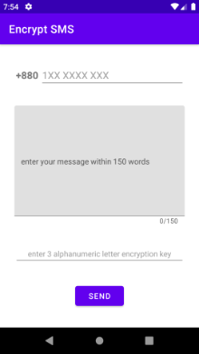
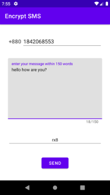
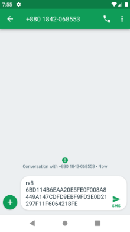
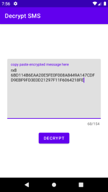
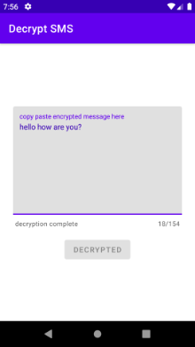

# Midterm Assignment  

Question - <https://docs.google.com/document/d/12ym0zKL4wGaKJ4H9-Cm1CfADjv30Wo-MEL-bBM2nzMI/edit>  

## Answer To Question-2: **Secret Text App**  

- Encrypt a text with an encryption key  
  
   &nbsp;&nbsp;&nbsp;&nbsp;&nbsp;&nbsp;&nbsp; 

- Send encrypted text to a phone number using default SMS app.  
  
  

- Decrypt received encrypted SMS with appropriate encryption key.  
  
   &nbsp;&nbsp;&nbsp;&nbsp;&nbsp;&nbsp;&nbsp;  &nbsp;&nbsp;&nbsp;&nbsp;&nbsp;&nbsp;&nbsp;
